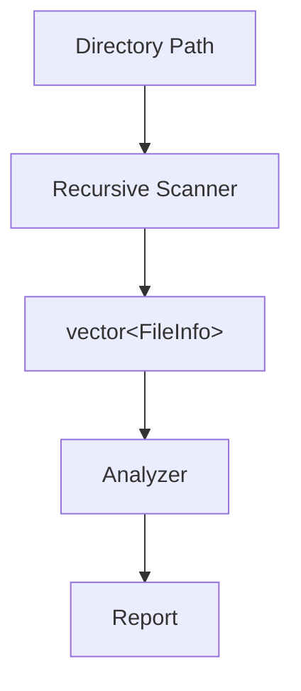
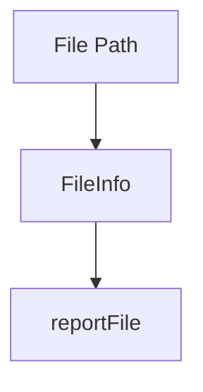
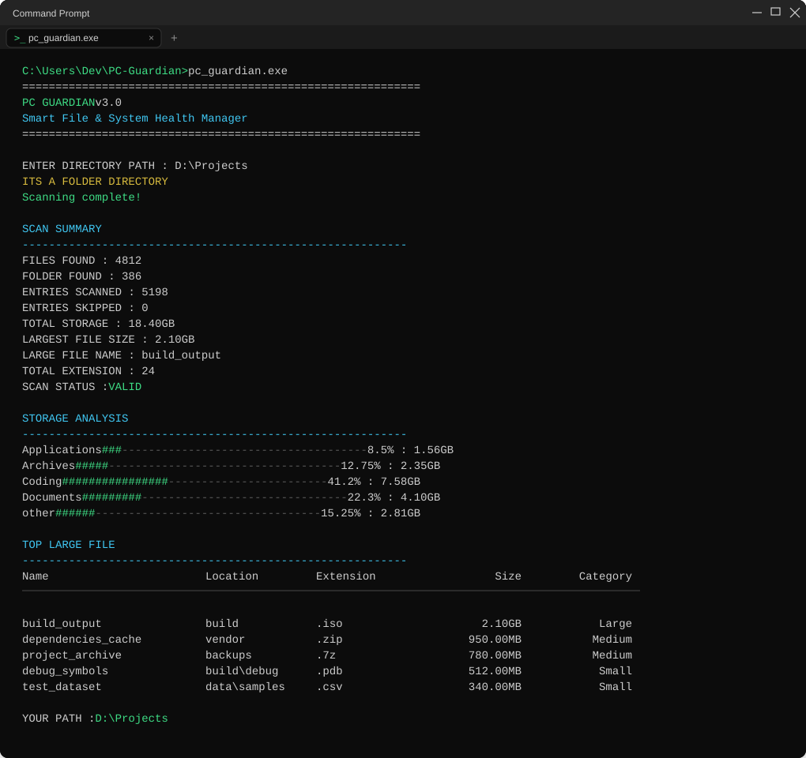

<div align="center">

# 🛡️ PC Guardian

### Smart File & System Health Manager

> Scan • Analyze • Report • Understand

A real-world C++ CLI project for scanning, analyzing and understanding files, directories and storage.


</div>

---

## 📖 About The Project

**PC Guardian** is a command-line application written in modern C++, built as a practical, hands-on way to get better at the language.

The goal isn't just to end up with a working tool — it's to actually understand *why* the code works, by building something real instead of only following along with tutorials. The project is developed incrementally, version by version, with each release adding a deliberate new set of skills and features on top of the last.

---

## 🧠 My Learning Journey

This project is where I'm putting the following concepts into practice:

- STL containers and algorithms
- `std::filesystem`
- `vector` and `map`
- Sorting and search algorithms
- Lambda functions
- Exception handling
- Recursive directory traversal
- Modular architecture
- Defensive programming
- CLI UI design
- Debugging real (not tutorial) bugs
- Structuring a real-world C++ project

Every version is built step-by-step, on purpose — the slow pace is the point.

---

## 📊 Current Progress

| Version | Focus | Status |
|:-------:|-------|:------:|
| **V1** | Basic File Scanner | ✅ Complete |
| **V2** | Storage Analyzer | ✅ Complete |
| **V3** | Deep System Scanner + Console UI | ✅ Complete |
| **V4** | File Intelligence | 🚧 In Progress |

**V3** brought recursive directory scanning, scan integrity checks, single-file detection and reporting, full directory analysis, console UI improvements, and defensive progress bars.

---

## ✅ V3 Features

- Recursive directory scanning
- File information collection
- Directory analysis
- Total file calculation
- Total folder calculation
- Total storage calculation
- Largest file detection
- Top-N largest files
- Extension analysis
- Category analysis
- Storage percentage calculation
- Human-readable file sizes
- Single-file reporting
- Scan integrity status
- Error handling
- Dynamic scanning progress bar
- Static storage bars
- Defensive console rendering
- File vs. directory reporting separation

---

## 🏗️ Architecture

PC Guardian is built around a clear separation of responsibilities:

- **Scanner** — collects raw filesystem data
- **Analyzer** — processes and calculates information from that data
- **Report** — presents the results to the user

Keeping these stages separate is a deliberate design decision — it keeps each piece simple, testable, and easy to extend as new versions are added.

**Directory scan flow:**



**Single file flow:**



---

## 📄 Single File vs. Directory Handling

A single file doesn't need to be forced into a full directory-style report table — it gets its own lightweight path instead:

- **Single file:** `File Path → FileInfo → Single File Report`
- **Directory:** `Directory Path → Recursive Scanner → vector<FileInfo> → Analyzer → Directory Report`

Example single-file report:

```text
FILE REPORT
----------------------------------------------------------
NAME         : example
LOCATION     : Documents
EXTENSION    : .cpp
SIZE         : 12.5 KB
CATEGORY     : Coding
SIZE TYPE    : Small
SCAN STATUS  : VALID
```

---

## 🧰 Tech Stack

**Language:** C++ (C++17)

**Libraries / Features used:**

| Header | Purpose |
|--------|---------|
| `<iostream>` | Console input/output |
| `<filesystem>` | Directory & file traversal |
| `<vector>` | Storing collected file data |
| `<map>` | Extension / category aggregation |
| `<algorithm>` | Sorting and searching |
| `<iomanip>` | Formatted console output |
| `<chrono>` | Timing, where applicable |

Runs in the Windows Terminal / Windows Console.

---

## 🖥️ Windows Terminal Showcase



*Stylized mockup of PC Guardian V3 output. Swap in a real screenshot of your terminal whenever you'd like — just keep the same file name and path.*

---

## ✨ Feature Highlights

### Recursive Scanning
Walks through nested directories, collecting file information at every level without missing subfolders.

### Storage Analysis
Calculates total storage used, then breaks it down by file extension and category so you can see where space is actually going.

### Largest Files
Identifies the largest file overall and surfaces a Top-N list, useful for quickly spotting what's eating up disk space.

### Single File Reports
Lets you point PC Guardian at one file and get a focused report, instead of running a full directory scan.

### Console UI
Progress bars, ANSI-style coloring, and clean formatting make scan output easy to read directly in the terminal.

---

## 🗺️ V4 Roadmap — File Intelligence

> V4 is a work in progress. Nothing below is implemented yet — this is the plan.

| Milestone | Focus | Status |
|-----------|-------|:------:|
| M1 | File Filtering | 🚧 Planned |
| M2 | File Search | 🚧 Planned |
| M3 | Advanced File Sorting | 🚧 Planned |
| M4 | Top-N File Intelligence | 🚧 Planned |
| M5 | File Age Analysis | 🚧 Planned |
| M6 | Age-Based Reports | 🚧 Planned |
| M7 | File Intelligence Dashboard | 🚧 Planned |

- **M1 — File Filtering:** Filter scanned files by extension, size, or category.
- **M2 — File Search:** Search for files by name or pattern within scanned directories.
- **M3 — Advanced File Sorting:** Sort results by size, name, extension, or date.
- **M4 — Top-N File Intelligence:** Deeper, more flexible Top-N analysis beyond the current largest-files view.
- **M5 — File Age Analysis:** Analyze files based on creation/modification age.
- **M6 — Age-Based Reports:** Generate reports grouped by file age.
- **M7 — File Intelligence Dashboard:** Bring filtering, search, sorting, and age analysis together into one consolidated view.

---

## 🎓 What I Learned

- `std::filesystem` and `recursive_directory_iterator`
- `vector` and `map` for organizing scanned data
- `std::sort` and comparator logic
- Lambda functions
- Exception handling, including filesystem-specific errors
- `std::clamp`
- Console rendering techniques
- Modular architecture
- Separating scanning from analysis
- Separating analysis from reporting
- Defensive programming habits

---

## 📁 Project Structure

> Example structure — will evolve as the project grows.

```text
PC-Guardian/
│
├── src/
│   └── main.cpp
│
├── assets/
│   └── pc-guardian-terminal.png
│
├── README.md
└── ...
```

---


<div align="center">

🤖 *README created with the assistance of AI.*

</div>
